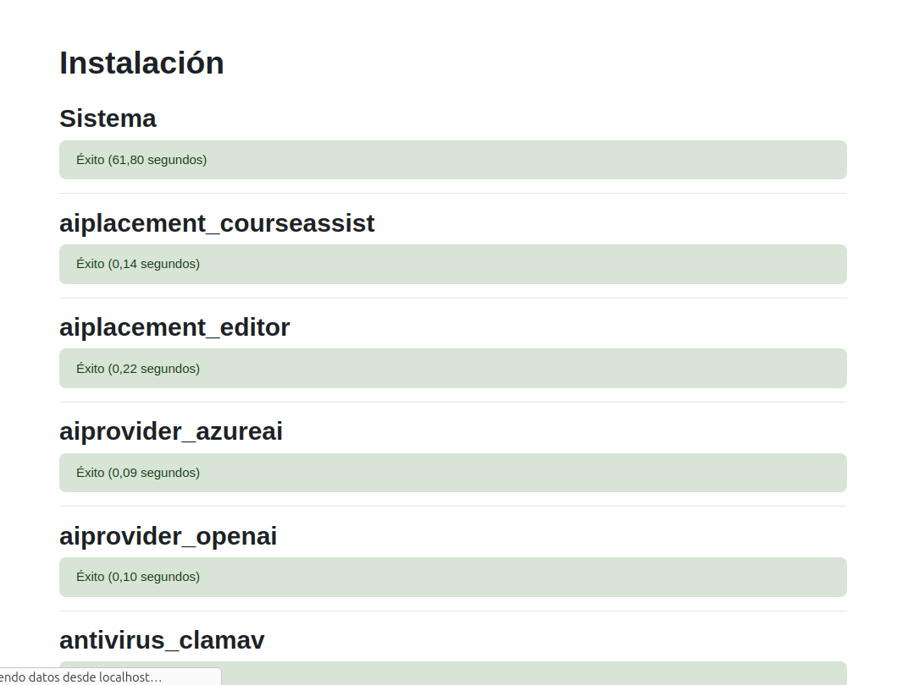

# moodle-rusben

El primer paso despues de descargar el moodle siguiendo el siguiente manual. (colocar manual rusben)

El siguiente paso es crear un directoria para guardar los datos del moodle.

Despues de eso nos aparecera una pantalla en la que deberemos darle a continuar.

Despues llegaremos a una pantalla en la que no podremos avanzar, para arreglarlo nos tenemos que meter en la termminal i entrar al directorio /etc/php/8.3/apache 2 i descargaremos nano php.ini

Una vez echo esto nos llevara al siguiente menu en el que tendremos que pulsar control W i buscar max_input_var.

Una vez echo eso hay que cambiar el 0 por 5001 i quitar las ; delante de "max" despues pulsamos control o i pulsamos enter.

ponemos el comando para reiniciar el apache.

Despues de esto la instalacion ya estaria completa, simplemente tenemos que avanzar entre las diferentes panatallas que no apareceran rellenando los datos.

Hasta llegar a esta pantalla la cual es la ultima i significa que todo ha ido a la perfeccion 

